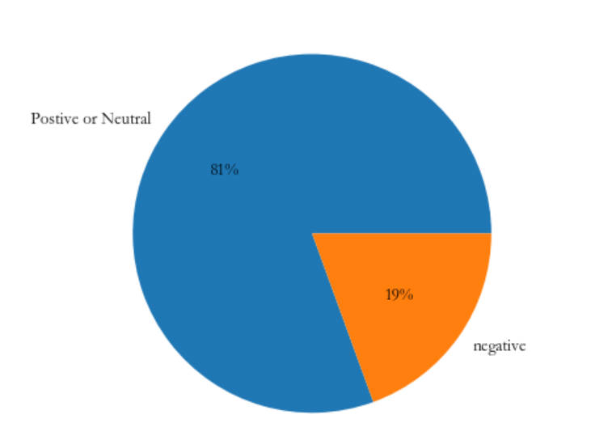
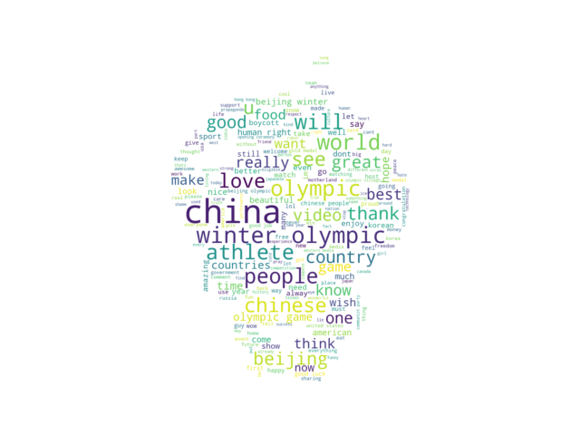
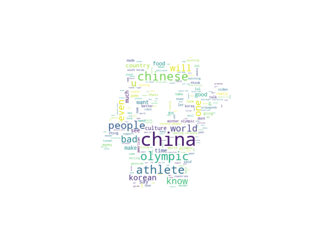

# 2022 BEIJING Winter Olympics commentary sentiment classification
> 前段时间好朋友给我提了个想法，想看看油管上对北京冬奥会的评价，稍微想了一下不是特别麻烦，就顺便做一做这个提升一下自己的代码能力。

### 学到的东西
* 数据获取
    1. selenium
    2. request
    3. re
    4. 对接youtube的api
* 数据处理
    1. csv
    2. 对接有道的api
    3. LSTM网络
    4. 借用IMDB的数据集
* 数据分析
    1. wordcloud
    2. matplotlib

简单说一下思路，先用selenium模拟浏览器刷新出youtube的视频，然后再用request把所有视频的名称和id爬下来，对接给youtube的api来获得所有主楼层的数据，并保存在csv文件里面。然后借用keras中IMDB自带的词向量，并用相同方法处理评论，送入LSTM网络里面训练，得到结果之后简单调用一下库。

看看数据分析：
**饼状图**

实际上一共22571条有效数据，81%为正面或者中性评论,19%为负面评论。（无论是哪一种，都不能完全代表是对冬奥会的评价，也许只是对视频的吐槽hh）
**正面或者中性的词云**

**对比一下负面的**

都是china提得最多，chinese啊people都不少，负面的没有明显看到olympic，那他们负面在哪了呢）。
还有，为什么负面里面能看到一个korean？Interesting.

可以这个过程是挺满足的，只不过最终实现的东西不过是个半成品，很多东西也不严谨，比如说强如LSTM也只能对IMDB的评论作出86%的正确率判断，所以最终用于判断评论的正负性的数据并不能完全可信，但至少可以确定的一点是，并不是特别多的负面消息。（截止2022/2/16）
总体来说是依然是十分成功的一届冬奥会！
~~虽然是半成品，但并没有继续做完的欲望~~